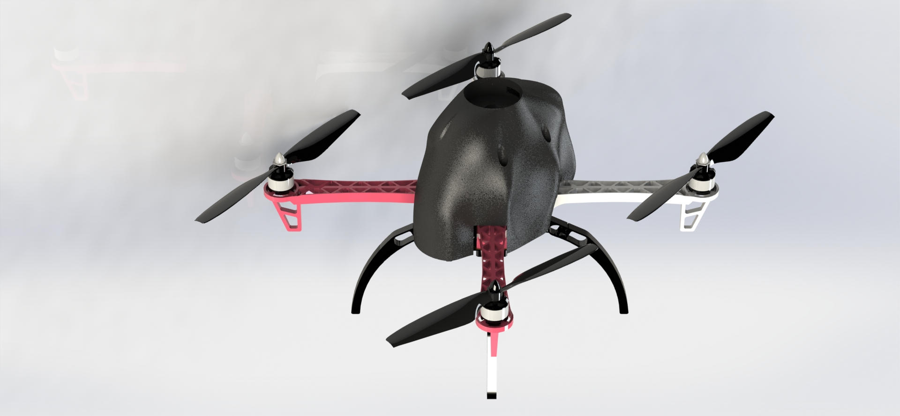

# PREDICT Project #

PREDICT Project at Aalborg University (AAU). This project is shared with Technical University of Denmark (DTU).
The project is focused on drone flight controller design and development, using a Real-Time Operative System implemented on a FPGA.

 


### Repository structure ###


##### Documentation #####

An overview and general description of this project is included in Microsoft Power Point format, see the Predict Handover presentation.pptx file.


On top of that, the complete report is also included in PDF format, see the Predict_doc.pdf file. For more details, the original Latex files of the document are inside the Predict_doc folder. In case of needing to re-build the document, use doxigen or pdflatex commands, such as:

```
cd ~/REPO_LOCATION/PREDICT/Predict_doc && pdflatex main.tex
```

The documentation provides a detailed description about the project goals, functionalities and implementation. Additionally, it includes at the end two appendices as tutorial chapters to build a drone, calibrate it and run the flight controller on it.


##### Hardware - Drone desgin #####

Two models (A and B) were developed for this project. The related files are on the folder hardware_design, which contains:

* Printed Circuit Board (PCB folder): a custom board desgined for this project, which connects all the components to the controller. Designed with DipTrace

* Mechanics design (CAD_files folder): all the body and custom parts assembly for both models. Done in Solidworks 2019.

* Simulation model (simulation folder): both models A and B imported into CoppeliaSim simulator and additional dependencies for using the flight controller with the simulator.




##### Software - Flight controller and other applications #####

The flight controller is designed for the Patmos architechture, specifically for the de10-nano FPGA. A copy of this architecture is on the flight_controller/de10-nano-drone folder, which is a project on Quartus Prime.

The flight controller works as an application on that runs on top of the Patmos architecture. This C application is located on the flight/controller/de10-nano folder and it has the following:

* Basic functionalities (basic_lib folder): header and external files with global variables, low-level and functionalities related mostly to Patmos and communication.

* Components (sensors folder): header files for handling and using all the components.

* Flying functionalities (FC_functionalities folder): header files for calibration and flying modes available.

* Test programs (sensors_tests folder): header and script files for running the test programs.

* Main flight controller files (Flight_controller_v2.c and PREDICTthread.h).


##### Others #####

In case of being new to Patmos architecture, the folder Bash_cmmd contains scripts and configuration files that are useful to download, compile and build the T-Crest repositories and also for downloading C-apps in a de10-nano board. 
These scripts and files are explained in detail in the Predict documentation, on the Appendices (Chapters 7 and 8).


##### References #####

The main reference for this project is the Arduino Quadcopter project from [Brooking](http://www.brokking.net/ymfc-32_main.html) and part of his project is on the Arduino_project folder. 

Apart from that, all other references are listed on the Predict project documentation, the Bibliography section.


-----------------------------------------------

### Authors ####

* Carolina Gomez Salvatierra, cgomez19@student.aau.dk

* Rahul Ravichandran, rravic19@student.aau.dk

* Mark Adamik, madami15@student.aau.dk

Supervisor: Anders la Cour-Harbo, alc@es.aau.dk

-----------------------------------------------
