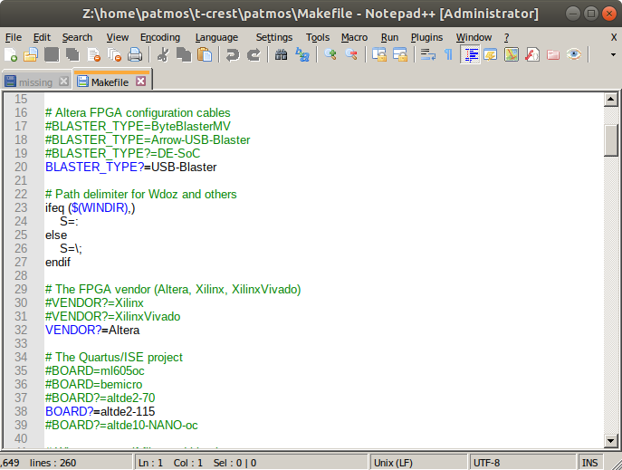
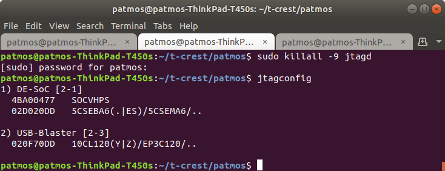
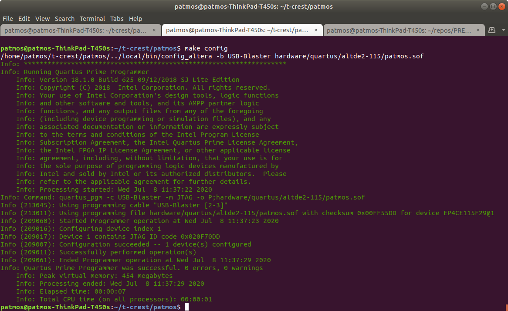
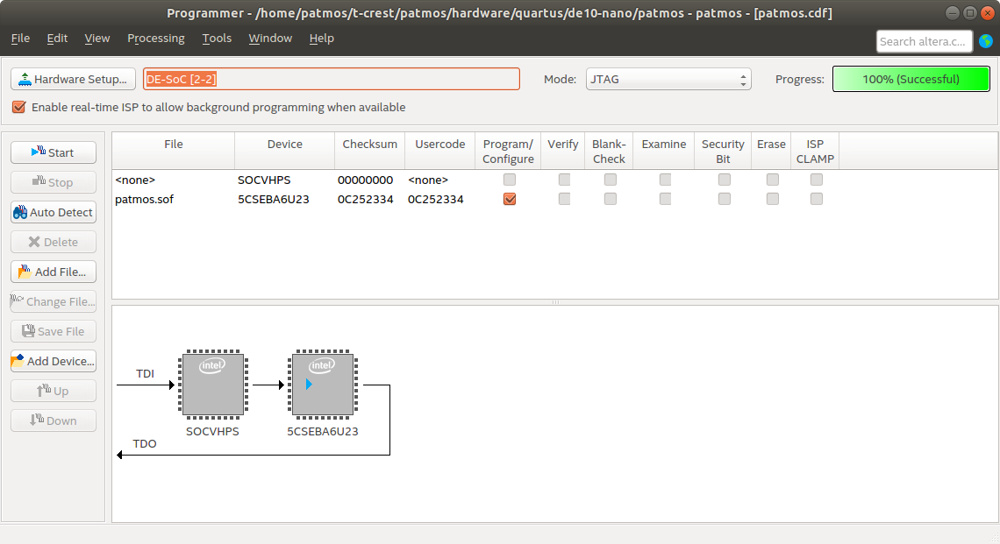
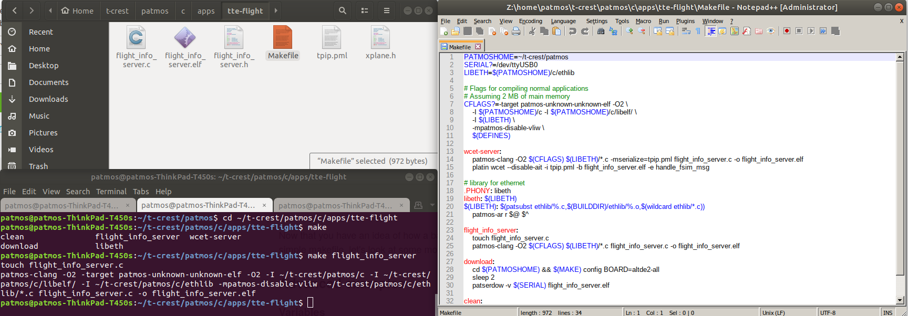
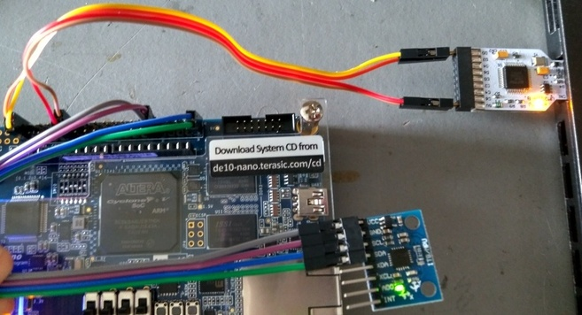
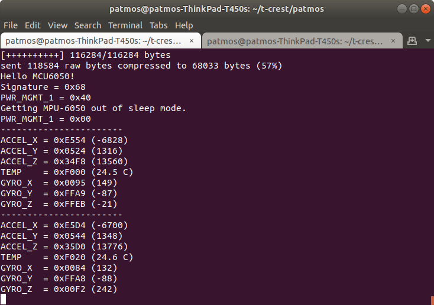
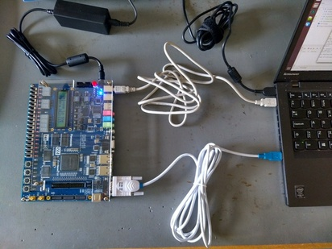
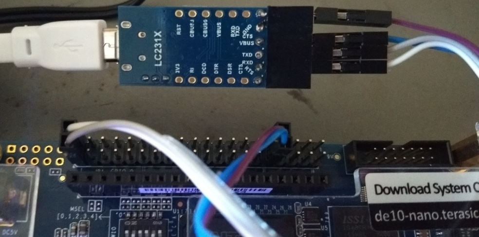
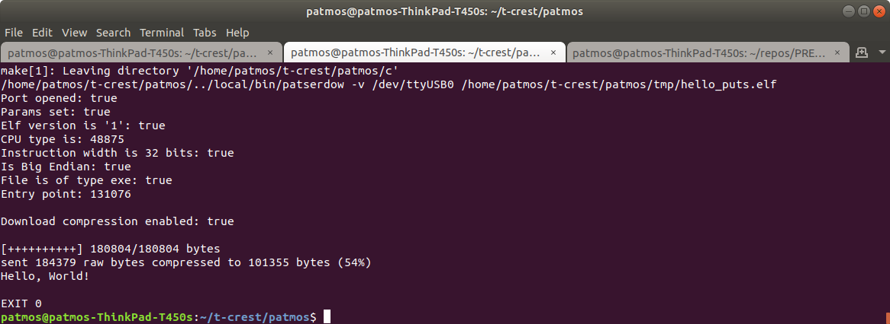

# Instructions #

These scripts and files are to meant to help to build patmos and download c code on the boards DE2-115 and DE10-nano. Some of the commands are in a script to automatically do it:
* To update repositories:
```
./fpga_update
```

* To build and download patmos with a "hello world" c code, specify the board on the MakeFile (see next section, step 3) and run one of these two:
```
./fpga_de2115
./fpga_de10
```

The file patmos_help.txt contains just a set of used instructions to go through. Some of them are listed here, and some of them are just information or ideas that could be used later.

### Building PATMOS ###

1. It's necessary to update the repositories, not just patmos, but also other libraries and dependencies among with it, you should have a folder called "t-crest" which contains at least three repositories: patmos, newlib and misc.
```
cd ~/t-crest
./misc/gitall pull
```

2. After pulling and updating all the repositories, build the libraries. Before running the following commands, delete the directory t-crest/newlib/build.
```
./misc/build.sh
```

In case of having some trouble building the libraries, you can try:
* Building only the newlib.
```
./misc/build.sh newlib
```

* Building everything from inside the misc folder and then re-try the newlib.
```
cd misc
cp build.cfg.dist build.cfg
./build.sh
cd ..
./misc/build.sh newlib
```


3. Modify the MakeFile inside the patmos repository, to specify the board and hardware connection type. Only necessary to (un)comment the BLASTER_TYPE and BOARD values.




4. Finally, build the patmos architechture for the board, which includes building its corresponding Quartus Prime project.
```
cd ~/t-crest/patmos
export BOARD=altde2-115
make -C hardware verilog BOOTAPP=bootable-bootloader BOARD=altde2-115
make synth
```


5. Optional: re-build the architecture tools.
```
cd ~/t-crest/patmos
make tools
make clean
```


### Downloading PATMOS ###

1. Make sure that the Quartus Project was built correcty, either on Quartus Prime or through the terminal (see previous section).


2. Check that the board-laptop communication is running properly. The best way is to kill the process and re-start it.
```
cd ~/t-crest/patmos/
sudo killall -9 jtagd
jtagconfig
```

In case of errors or that the detection is taking too long, repeat the commands. This screenshot shows the connection of the two boards (DE-SoC for de10-nano and USB-Blaster for DE2-115):




3. This process is different for each board:

* For the DE2-115: run the following command on the terminal:
```
make config
```



* For the DE10-nano: download the project through Quartus Prime:
	- Open Quartus Prime and the project ~/Location patmos directory here/patmos/hardware/quartus/de10-nano/patmos.qpf
	- Compile the Design (necessary to do this once). This project should be compiled without errors, if errors were given, check the update and building repositories process.


- Open "Program Device" (under "Compile Design" and "Edit Settings").
- Select the Hardware set-up and download the project.




If any errors were given associated to the JTAG, rerun the jtagconfig commands.


### Building c code for PATMOS ###

1. Create a folder for it on the directory ~/Your patmos location here/c/apps.


*A simple .c file*


2. Place in that folder your .c code and all its dependencies and .sh libraries.


3. Convert the .c code in an application. The ouput is an .elf file that must be located on the /tmp/ folder.
```
cd ~/Your patmos location here/patmos/c/apps/your folder here
patmos-clang -o ~/t-crest/patmos/tmp/hello.elf hello.c
```

Now the name of the app should be the same as the .elf file and it's the one that is going to be downloaded on the board.


*More complex apps*


2. Place in the folder the .c files, .sh libraries and a Makefile.


3. Build the complete folder. Take the other apps as examples. The Makefile specifies a concrete set of variables and has different options (e.g. compile, sim, clean,...). In case of using an example app, check which command is the one that converts to .elf file after compiling. 
```
cd ~/Your patmos location here/patmos/c/apps/your folder here
make
```
The next screenshot shows the content and commands to build the example app tte-flight:
* Top-left: application files.
* Bottom-left: command terminal.
* Right: Makefile content.




4. Further development:
* In this repository there are two c apps included: de10-nano and de10-IMU.
* de10-nano is an example app from the original patmos repository to test the communication with an IMU. To use it on the board (after downloading patmos on it):

```
cd ~/t-crest/patmos
make app APP=de10-nano download
```


* de10-IMU is our own first c app, to start programming the flight controller and is based on the previous one.


### Downloading c code ###

1. Specify FPGA drivers connection on your ubuntu computer. See the 51-usbblaster.rules file in this repository and copy it to your laptop, on /etc/udev/rules.d
In case this file is already on your computer, check its content is the same.


2. Reload the rules and add your log-in user to be allowed to access the connection ports. Then log-out and log-in again.

```
sudo udevadm control --reload
sudo usermod -a -G dialout $USER
```


3. The process done through the additional UART ports on the boards, so it's necessary an adapter UART-Usb.
* For the DE2-115: there is a complete UART port one the board and adapters have been provided by the Componenten lab.
On the picture: top cable -> USB cable to download patmos, bottom cable -> UART-USB cable to download c code apps.



* For the DE10-nano: there is no port, so the Quartus Prime project has designed an UART connection through the I/O pins. So it is necessary a special adapter to connect the laptop to the board.
* WARNING!: download patmos on this board BEFORE connecting its UART to the laptop. Otherwise a shortcout could happen.
* Follow the instructions of the README.md file on the directiory /patmos/hardware/quartus/de10-nano to set up the switches and pins for the UART.
* Connect the UART pins to the adapter. Here there is an example:
```
Pin+Number | Wire colour | Adapter
------------------------------------
    rxd 1  |    white    | rxd
    txd 2  |    grey     | txd
   3.3V 29 |    purple   | VBUS
    GND 30 |    blue     | GND
```



4. Connect the board(s) to the laptop. If the connection has been successful, the directory /dev/ a special file "ttyUSB0" should have been generated. If not, check steps 1 and 2 and plug the board again.

5. Download the built app (.elf file) on the board.

```
cd ~/Your patmos location here/patmos
make BOOTAPP=bootable-bootloader APP=hello_puts tools download
```



In case of error:
* _Port not found_ : review the rules and UART-USB connection.
* _Port denied_ : review the user access.
* _Receiver did not reply correctly (expected 62 got 10)_ : this can happen with any other numbers for "expected" and "got". Once a c app has been successfully downloaded, the UART is usually no longer receptive to download apps. To fix this, re-plug the USB-UART to the laptop (maybe more than once). If after some tries, it still does not work, re-boot the FPGA and reload patmos and the app.
* (After downloading process) _Exception Timeout_: problem with the bus wires. The laptop was able to communicate with the bus, but the info did not reach the board. Review the pins/cable adapter and re-boot the FPGA.
* Other errors: maybe it's a hardware problem change cable or re-try with another board if the two previous points are OK. For more info, review the pins assignment and the corresponding manuals.
